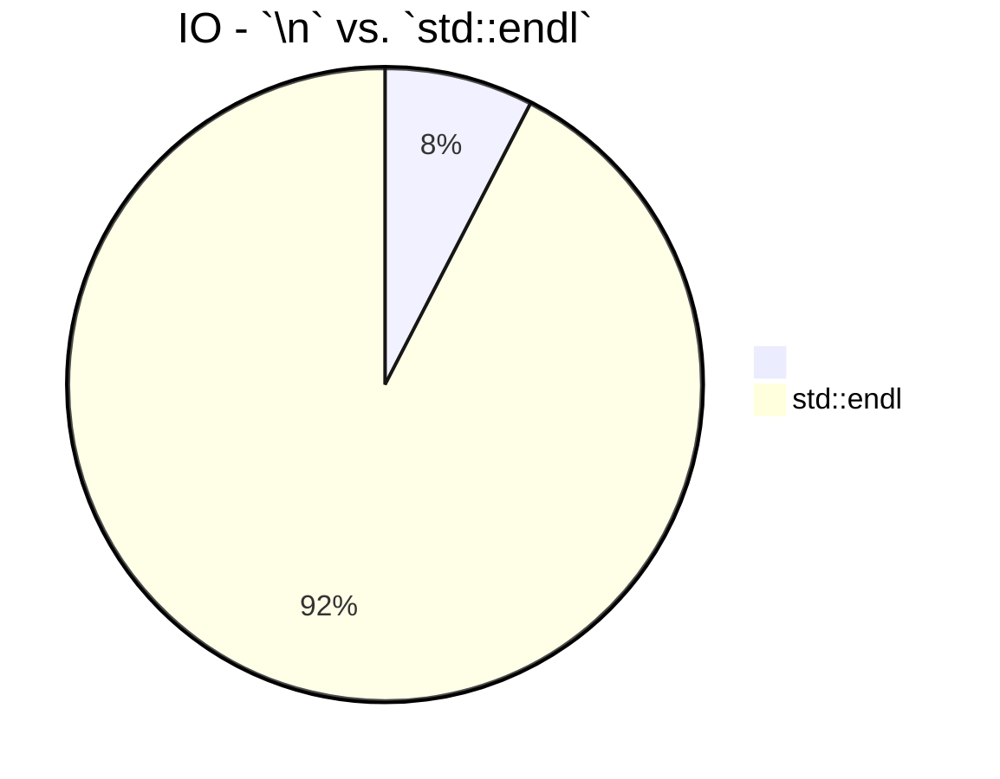
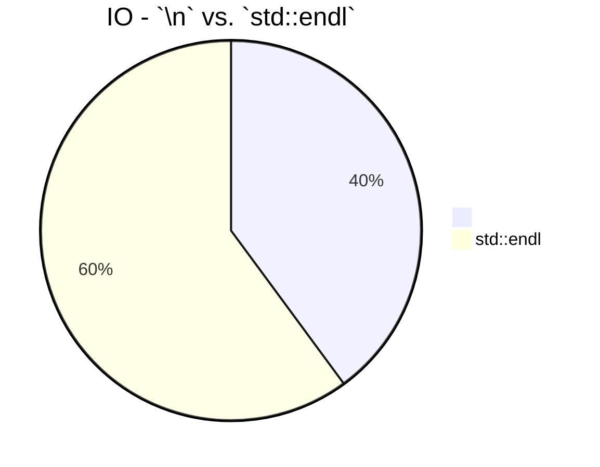
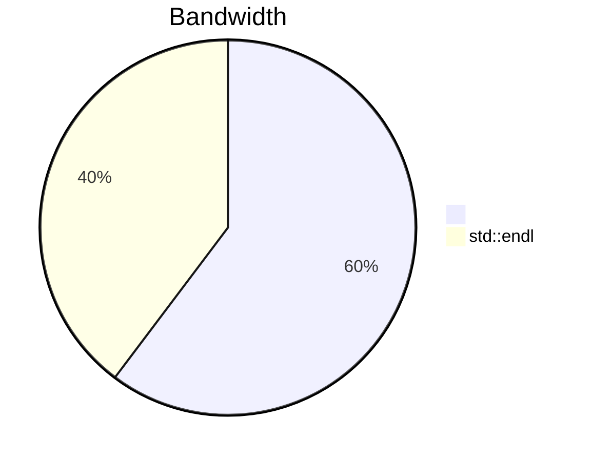
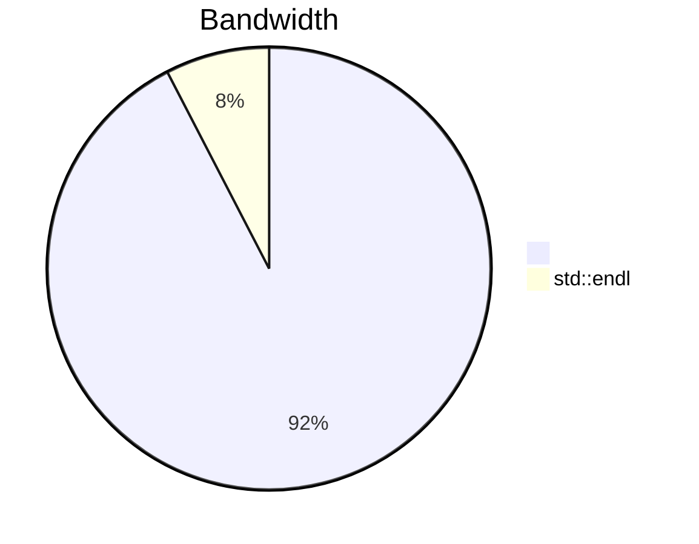

# IO Benchmarking - results

The algorithm was performed in the `IO_Perf` class, and it was composed of two parts:

1. Writing `n_data` strings into an output file on disk using a `\n` (newline character) in order to get a new line after each iteration, until `n_data` strings are written.
2. Writing the same amount of strings into a different file, but after each iteration, instead of the newline character, the `std::endl` function will be used (which flushes the output stream each time is called).

In the testing example, the number of iterations (`n_data`) is 10000000.
The writing procedure is done into the constructor of the `IO_Perf` class, and a time measurement method is used to compute the execution time of the two writing procedures.

When class is called by the *smart pointer* from the main function, it takes the number of strings which need to be written into the files as argument. Then two writing procedures are called, one after the other; the first one is writing to the output file with `\n` and the second one flushes the stream.

Each function is individually measured in terms of time performance. The duration of each process is stored in a global variable, and then passed to a tuple, that is specific for keeping the timings of the two functions.

Once the two timing measurements are performed inside `write` and `write_endl`, the **bandwidth** is also computed for each of the two procedures. The bandwidth is calculated as the ratio of the total memory (in MB) of the strings written in each of the files, to the total time needed by the respective procedure to write the data to the file.

Time measurements were performed in microseconds inside the two writing procedures, but transformed into seconds when computing the bandwidth and the output of results.

### Results - time performance

#### Example run 0



#### Example run 1




***These examples are for a large number of strings written in the two files: N=100000000.***

> *The fact that the first run gives much worse results for flushing the stream is an interesting feature, which is obtained consistently along all the test runs for different number of string copies.*
___
With an example of a test run in CL:

```bash
N= 100000000
Total data (in MB) written to file: 17500
Benchmark finished...
Writing the data into a file with newline char took: 5059.87 ms
IO Bandwitdh: 3458.59 MB/s
Writing the data into a file with std::endl took: 7627.93 ms
IO Bandwitdh: 2294.2 MB/s
Flushed 100000000 string streams in 12687.8 ms
```

___

### Results - bandwidth performance

As mentioned, the bandwidth is computed after the timing measurements for the two writing procedures are finished, and they are calculated as the ratio of the total number of Megabytes as string data in the file, over the total time required for each writing procedure to be finished.

#### Example run 0



#### Example run 0



As expected the ratio of the bandwidth is the same as the one from timing measurements, since they are both proportional with the number `N` of strings which need to be written in the files.
